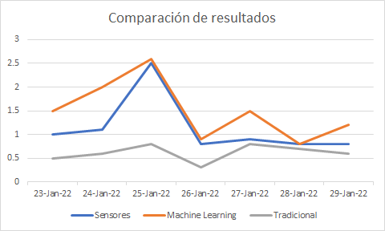

# Desafío JavaScript

El objetivo de esta prueba de código es que demuestres tus habilidades y conocimientos sobre el lenguaje JavaScript y sobre los frameworks Express.js y React. Además, sirve como referencia para el trabajo que se desarrolla en los proyectos que estarás asignado en Brein.

## Requisitos

Para desarrollar este desafío, es necesario que tengas los siguientes componentes:

- Node.js 16

## Indicaciones

### 1. Agregar un endpoint

En el directorio backend de este repositorio se encuentra un proyecto desarrollado en Express.js. Para ejecutarlo, puedes utilizar el script **serve**.

```sh
$ cd backend
$ npm run serve
```

Para este desafío debes **agregar un endpoint en la ruta _/reales_ del API backend para que retorne los valores que están al inicio del archivo _reales.js_, en la variable _onzasMedidas_**.

El resultado de una solicitud HTTP GET a la URL _/reales_ debe ser

```json
{
  "sensores": [1,1.1,2.5,0.8,0.9,0.8,0.8],
  "fechas":["2022-01-23","2022-01-24","2022-01-25","2022-01-26","2022-01-27","2022-01-28","2022-01-29"]
}
```

### 2. Agregar un gráfico

Utilizando la aplicación generada con el paquete **create-app-react** que se encuentra en el directorio _/frontend_, **agrega un componente que muestre un gráfico comparando los valores obtenidos del backend**. El gráfico debe mostrar las fechas y valores tanto de las estimaciones como de las mediciones reales. Por ejemplo:



## Indicaciones finales

El tiempo para desarrollar este desafío es de 90 minutos. Si consideras que te faltó implementar alguna mejora o requisito del desafío, puedes agregar tus comentarios actualizando el archivo PENDIENTE.md que se encuentra en la ruta raíz del repositorio.

Suerte!